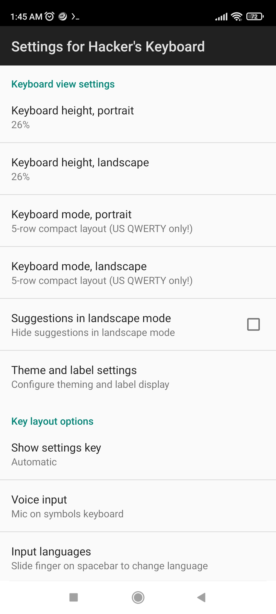

# download hacker keyboard on google playstore

[DOWNLOAD](https://play.google.com/store/apps/details?id=org.pocketworkstation.pckeyboard&hl=en&gl=US)

```bash
go to setting > currnt keyboard > change to Hacker keyboard

why ? for qwerty feature like CTRL, ALT ,TAB , many Symbol , etc 

setting for 6,7'in display   :
```

