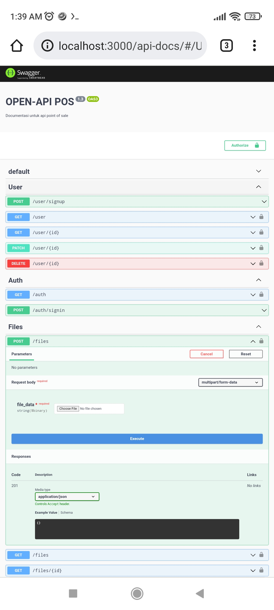
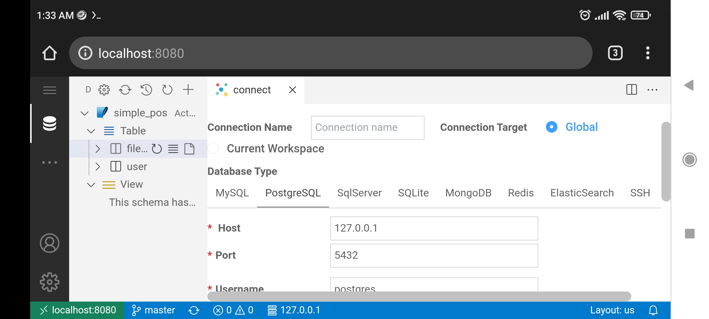

# EKI RESEARCH & DEVELOPMENT

# Tested 2022-01-22

Hardware :
- Xiaomi Redmi Note 9 Pro  (WITHOUT ROOT)

Tools Apk: 
- Andronix (version 4.x) , https://docs.andronix.app/unmodded-distros/unmodded-os-installation/
- Termux https://f-droid.org/en/packages/com.termux/ 
- JuiceSSH
- Hacker's Keyboard 

Result :
- Ubuntu server 20.04 (CLI-ONLY) on android OS
- NVM (multi nodejs version)
- Code Server (visual studio code on Web)
- Database Client (cweijan from Visual Studio Code extention)


# NOTE ANDROID WITHOUT ROOT
# NOTE ANDRONIX CANT USE DOCKER https://docs.andronix.app/get-started/limitations/


<details>
  <summary>[click step 1] Hacker's keyboard (QWERTY, LIKE WINDOWS KEYBOARD FEATURE)</summary>


[==> CONFIG](EKI_BEST_CONFIG_HACKER_KEYBOARD.md)

</details>


<details>
  <summary>[click step 2] Server Configuration</summary>

[==> CONFIG](EKI_BEST_CONFIG_INSTALL_UBUNTU_SERVER_20.04LTS.md)

</details>


<details>
  <summary>[click step 3] Install Nodejs Multi Version</summary>

[==> CONFIG](EKI_BEST_CONFIG_INSTALL_NODEJS_MULTI_VERSION.md)

NesJS latest no issue tested (After install multi nodejs / NVM)



</details>


<details>
  <summary>[click step 4] CODE-SERVER (After setting: font 8, diable auto complite, disable minimap)</summary>

  [==> CONFIG](EKI_BEST_CONFIG_CODE_SERVER.md)


</details>


<details>
  <summary>[click step 5] Multi Databases Client</summary>



[==> CONFIG](EKI_BEST_CONFIG_DATABASE_CLIENT.md)

</details>


# NOTE RUN

for run code-server better from termux console

```bash

./start-ubuntu20.sh

code-server /home/FILES

open localhost:8080

```

for run node / nodejs library better from ssh with JuiceSSH

root@127.0.0.1 -p 2222

masuk123

```bash

Angular ex : 

ng serve

open localhost:4200

NestJs ex : 

npm run start:Dev

open localhost:3000
```


# Regards,

# Eki Indradi
"TIME > KNOWLEDGE > MONEY".


