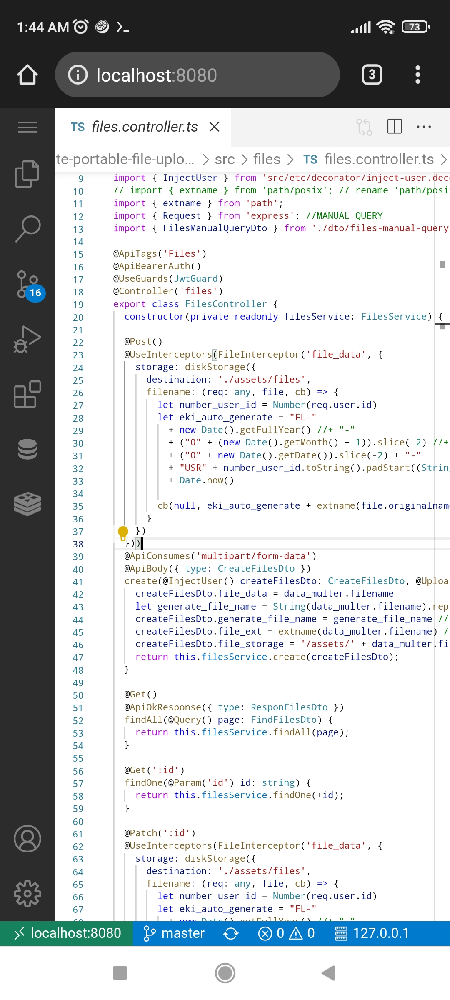

# EKI RESEARCH & DEVELOPMENT

# Tested 2022-01-22

Hardware :
- Xiaomi Redmi Note 9 Pro

Tools Apk: 
- Andronix (version 4.x) , https://docs.andronix.app/unmodded-distros/unmodded-os-installation/
- Termux https://f-droid.org/en/packages/com.termux/ 
- JuiceSSH
- Hacker's Keyboard 

Result :
- ubuntu server 20.04 (CLI-ONLY) on android OS
- NVM (multi nodejs version)
- code-server (visual studio code)
- Database Client (cweijan from Visual Studio Code extention)

  
Hacker's keyboard (QWERTY, LIKE WINDOWS KEYBOARD FEATURE)

  
MULTI DATABASE CLIENT

  
CODE-SERVER (After setting: font 8, diable auto complite, disable minimap)

  
NesJS latest no issue tested (After install multi nodejs / NVM)

# tutorial in file EKI_BEST_CONFIG.md

# Regards,

# Eki Indradi
"TIME > KNOWLEDGE > MONEY".

